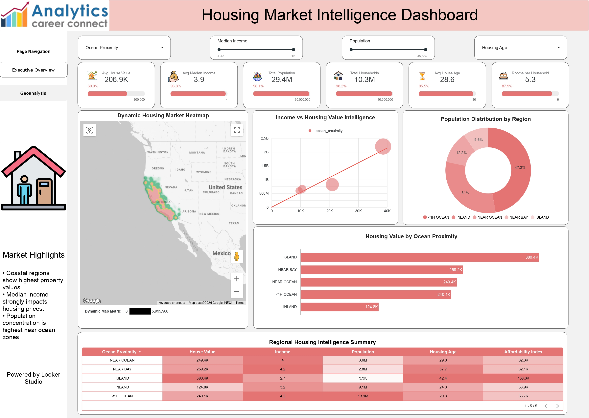
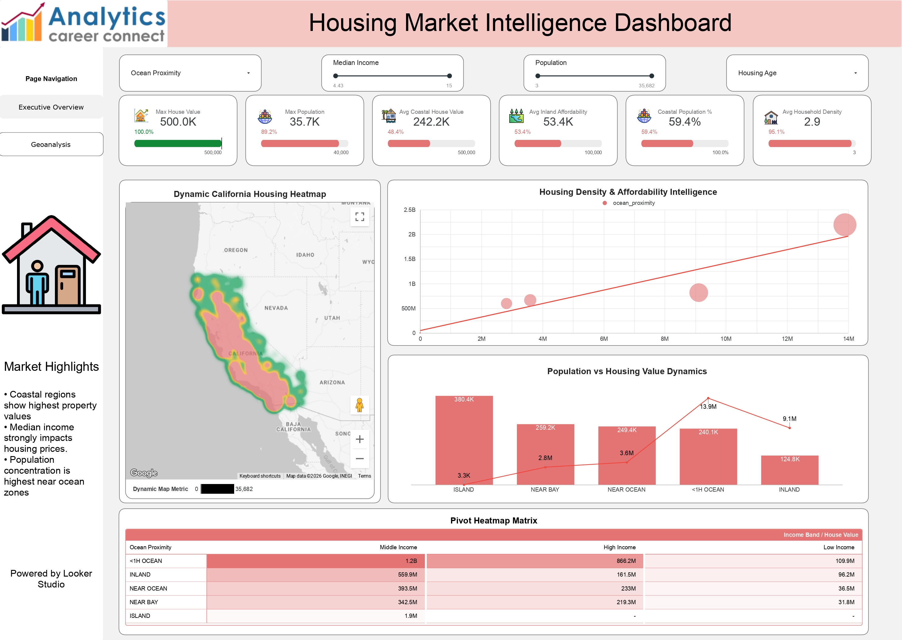

# 🏡 Housing Market Intelligence Analysis

A comprehensive **Google Looker Studio** dashboard designed to provide data-driven insights into housing trends, property values, location-based demographic analysis, and key real estate market indicators.

🔗 **[Click here to view the Housing Market Intelligence Dashboard](https://datastudio.google.com/u/0/reporting/6594147e-7ccc-4518-a600-f891b471f353/page/p_7fffdzd73d)**  


---

## 🖼️ Dashboard Preview

### 1. Executive Overview & Geoanalysis
High-level market summary tracking average house values ($206.9K), median income, total population (29.4M), and regional distributions. Includes a dynamic U.S. housing heatmap and regional intelligence summaries.


### 2. Deep Dive: California Market & Affordability
Focused analysis on high-density areas, tracking maximum house values ($500K), coastal vs. inland affordability metrics, housing density, and an interactive pivot heatmap matrix comparing income bands.


---

## 📊 Key Market Highlights

Based on the interactive data models, the dashboard reveals several core real estate trends:
* **Location Premium:** Coastal regions and Island properties show significantly higher property values compared to inland zones.
* **Income Correlation:** Median income serves as a strong leading indicator and strongly impacts local housing prices.
* **Population Density:** Population concentration remains highest in "Near Ocean" and "<1H Ocean" geographic zones (accounting for nearly 78% of the tracked population).

---

## 🛠️ Tools & Technologies Used

* **Google Looker Studio:** Core visualization platform used to design the interactive UI, heatmaps, and dynamic scatter plots.
* **Data Visualization & Analytics:** Engineered pivot heatmap matrices, combo charts, and geographic map charts to represent dense housing datasets.
* **Data Cleaning & Preparation:** Processed underlying housing data (`housing.csv`) to categorize ocean proximity, calculate affordability indexes, and group income bands.
* **CSV:** Primary data structure containing raw housing metrics, coordinates, and demographic counts.

---

## ⚙️ Dashboard Features

* **Dynamic Heatmaps:** Interactive geographic maps filtering housing data across the United States and California specifically.
* **Affordability Tracking:** Custom metrics comparing average coastal house values ($242.2K) against average inland affordability.
* **Custom Filtering:** Top-level page navigation and interactive slicers for Ocean Proximity, Median Income, Population, and Housing Age.
* **Income vs. Value Intelligence:** Scatter plot correlations mapping how median income scales directly with property valuations across different geographic classifications.

---

## 📂 Repository Structure

```text
Housing_Market_Intelligence_Analysis/
│
├── Housing_Market_Intelligence_Dashboard_page-0001.jpg # Page 1 preview
├── Housing_Market_Intelligence_Dashboard_page-0002.jpg # Page 2 preview
├── Housing_Market_Intelligence_Dashboard.pdf           # Full PDF export
├── README.md                                           # Project documentation
└── housing.csv                                         # Primary dataset
